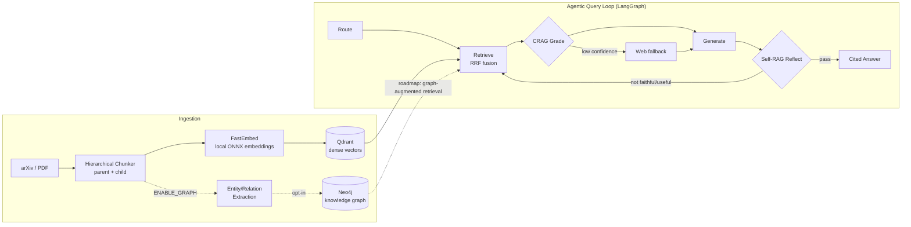

# PaperGraph-RAG

**Agentic GraphRAG for understanding the latest AI research papers.**

Ask questions about cutting-edge AI research and get grounded, cited answers. PaperGraph-RAG
ingests papers straight from arXiv, indexes them with hybrid (dense + sparse) retrieval and a
Neo4j knowledge graph, then answers questions through an **agentic loop** that self-corrects its
retrieval (CRAG) and reflects on its own answers (Self-RAG) before responding.

It runs entirely on **free-tier infrastructure**: local ONNX embeddings (no API key) and
[Groq](https://console.groq.com) for generation.


&nbsp;
&nbsp;

---

## Why it's interesting

Most RAG demos are a single embedding lookup followed by one LLM call. This system implements the
techniques used in production-grade retrieval pipelines:

- **Agentic orchestration** — the whole query flow is a
  [LangGraph](https://langchain-ai.github.io/langgraph/) state machine
  (`route → retrieve → grade → generate → reflect → loop`), not a linear script.
- **Corrective RAG (CRAG)** — an LLM grades each retrieved chunk; on low confidence the loop falls
  back to live web search (optional, via Tavily).
- **Self-RAG** — the agent reflects on its own draft (is it *relevant*, *faithful*, *useful*?) and
  re-retrieves if the answer doesn't hold up, bounded by a max-iteration guard.
- **Dense retrieval + RRF fusion** — semantic search over hierarchical (parent/child) chunks,
  scored through a Reciprocal Rank Fusion layer built to fuse multiple retrievers.
- **Knowledge-graph enrichment** — opt-in (`ENABLE_GRAPH=true`), ingestion runs LLM
  entity/relation extraction (papers, authors, methods, datasets, benchmarks) into **Neo4j**, with
  parametrized Cypher builders for multi-hop lookups.
- **Evaluated** — answer quality is measured with [RAGAS](https://docs.ragas.io)
  (faithfulness, answer relevancy, context recall/precision).

## Architecture



**Query flow:** `route → retrieve → CRAG grade → generate → Self-RAG reflect → (loop or finalize)`.
Solid edges are wired today; dotted edges are opt-in (graph enrichment) or on the roadmap
(graph-augmented retrieval).

## Quickstart (Docker — one command)

The whole stack — API, Qdrant, and Neo4j — comes up together.

```bash
# 1. Get a free Groq API key at https://console.groq.com
cp .env.example .env
#    then set GROQ_API_KEY=... in .env

# 2. Launch everything
docker compose up --build

# 3. Ingest a few papers straight from arXiv (no paid key needed)
curl -X POST localhost:8000/ingest \
  -H 'content-type: application/json' \
  -d '{"arxiv": "retrieval augmented generation", "max_results": 5}'

# 4. Ask a question — runs the full agentic loop
curl -X POST localhost:8000/query \
  -H 'content-type: application/json' \
  -d '{"query": "How does RAG reduce hallucination compared to a parametric LLM?"}'
```

The API serves interactive docs at **http://localhost:8000/docs** and a health/readiness
probe at **/healthz**.

## Quickstart (local CLI)

```bash
pip install -e .                     # core deps (free-tier: FastEmbed + Groq)
docker compose up -d qdrant neo4j    # just the data stores

papergraph arxiv "2310.06825" -n 1   # ingest by arXiv id (Mistral 7B)
papergraph arxiv "chain of thought prompting" -n 5
papergraph query "What is chain-of-thought prompting and when does it help?"
```

## Free-tier by default

| Component   | Default (free)                          | Optional upgrade                    |
|-------------|-----------------------------------------|-------------------------------------|
| Embeddings  | FastEmbed `bge-small-en-v1.5` (local, 384-d) | OpenAI `text-embedding-3-large` |
| Generation  | Groq `llama-3.3-70b-versatile`          | Gemini / OpenAI                     |
| Vector DB   | Qdrant (Docker / Qdrant Cloud free tier)| —                                   |
| Graph DB    | Neo4j (Docker / Aura Free) — *optional* | —                                   |
| Web fallback| disabled                                | Tavily (free tier)                  |

Only one key — `GROQ_API_KEY` — is required to run. Ingestion and retrieval work with **no key at
all**; the graph layer is optional and the app degrades gracefully to vector RAG if Neo4j is
unreachable.

Switch providers with env vars:

```bash
LLM_PROVIDER=openai EMBEDDING_PROVIDER=openai OPENAI_API_KEY=sk-...
```

## Cloud deployment

A [`render.yaml`](./render.yaml) Blueprint deploys the API to [Render](https://render.com)'s free
tier, backed by managed **Qdrant Cloud** and **Neo4j Aura Free** (more reliable than running the
databases as free-tier containers). See the comments in `render.yaml` for the four-step setup.

## API

| Method | Path       | Description                                                  |
|--------|------------|--------------------------------------------------------------|
| `GET`  | `/healthz` | Liveness + Qdrant/Neo4j connectivity (`ok` / `degraded`).    |
| `POST` | `/ingest`  | Ingest by `arxiv` query/ids or a local `path`.               |
| `POST` | `/query`   | Run the agentic loop; returns answer, citations, confidence. |

## Tech stack

Python 3.11+ · FastAPI · Typer · LangGraph · Qdrant · Neo4j · FastEmbed (ONNX) · Groq ·
RAGAS · Pydantic · Docker · Ruff · pytest

## Project structure

```
app/
├── api/          FastAPI app (/healthz, /ingest, /query)
├── agents/       LangGraph loop: router, CRAG, Self-RAG, graph wiring
├── ingestion/    arXiv loader, PDF parser, hierarchical chunker
├── indexing/     Qdrant hybrid store, Neo4j graph store, embeddings
├── retrieval/    hybrid retrieval + RRF fusion
├── graph/        entity/relation extraction, Cypher builders
├── llm/          Groq / Gemini / OpenAI providers
├── config.py     env-driven settings (provider selection)
└── factory.py    builds providers/retriever/graph from config
cli/              `papergraph` command
eval/             RAGAS evaluation harness + golden set
tests/            deterministic unit tests (no external services)
```

## Development

```bash
pip install -e ".[extras,eval]"
python -m pytest -m unit -q      # fast, no external services
python -m ruff check app/ cli/ tests/
python eval/run_ragas.py         # requires keys + a populated index
```

## Roadmap

- **Sparse BM25 fusion** — write sparse vectors at ingest and fuse them with dense results in the
  existing RRF layer (the fusion code already supports multiple retrievers).
- **Graph-augmented retrieval** — feed Neo4j multi-hop Cypher results into the query loop (the graph
  is populated and the Cypher builders exist; they are not yet wired into retrieval).
- LLM-based query routing (the current router is heuristic)
- Cross-encoder reranking (FastEmbed reranker)
- HyDE / step-back query transforms
- Multimodal figure captioning

## License

[MIT](./LICENSE)
