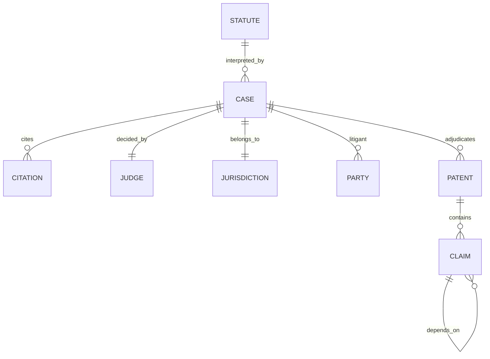
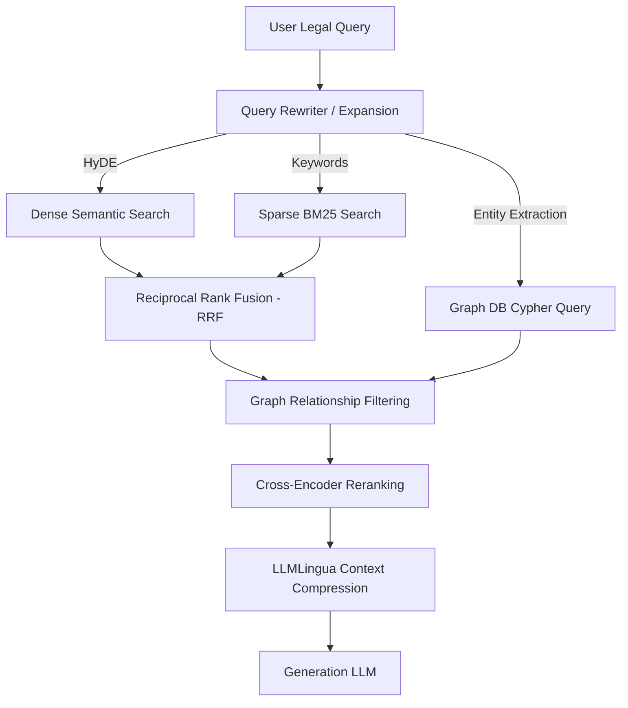
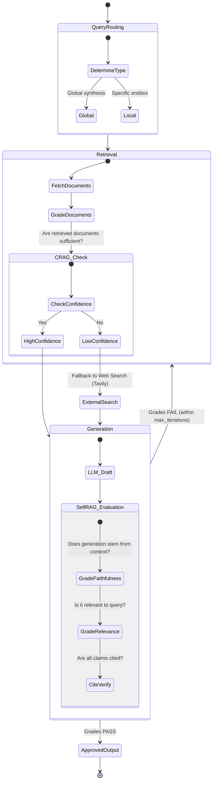

# LexGraph-RAG: Advanced Legal Case Law & Patent Intelligence System
## Architecture & Implementation Specification

**LexGraph-RAG** is a Retrieval-Augmented Generation system for **Legal Tech, Case Law Analytics, and Patent Infringement Analysis**. Legal analysis demands high precision, multi-hop reasoning (statutes ↔ precedents ↔ patent claim trees), long-context understanding, and verifiable sourcing to eliminate hallucinations. The system combines **Graph RAG**, **hierarchical vector search**, **agentic self-correction (CRAG / Self-RAG)**, and **multimodal document processing**.

This document is both the **architecture reference** (Sections 4–10) and the **implementation plan** (Sections 0–3). Read Sections 0–3 first to build; consult 4–10 for the design rationale behind each component.

---

## 0. Implementation Plan Summary (read this first)

### 0.1 Tech Stack (pinned)

| Concern | Choice | Notes |
| :--- | :--- | :--- |
| Language / runtime | **Python 3.11+** | RAG ecosystem standard. |
| Package / env mgmt | **uv** (or Poetry) | Lockfile committed. |
| Agent orchestration | **LangGraph** | State-machine for the CRAG/Self-RAG loop (Section 7). |
| Retrieval / chains | **LangChain** | Retrievers, embeddings, LLM adapters, document loaders. |
| Vector DB | **Qdrant** | Native hybrid (dense + sparse/BM25) + payload filtering + RRF. `pgvector` is the fallback if a single Postgres dependency is preferred. |
| Graph DB | **Neo4j 5.x** | Property graph + GDS library for Leiden (Phase 4). |
| Embeddings | **OpenAI `text-embedding-3-large`** | See ⚠️ dimension note in 0.4. |
| Generation LLM | **Gemini 1.5 Pro** (primary), **GPT-4o** (fallback/eval) | Abstract behind an `LLMProvider` interface so either is swappable. |
| Reranker | **Cohere Rerank v3** | `bge-reranker-large` (local) as offline fallback. |
| Web fallback (CRAG) | **Tavily** (or Exa) | Replaces Westlaw/LexisNexis, which are paid/contract-gated (aspirational only). |
| API surface | **FastAPI** | `/query`, `/ingest`, `/healthz`. |
| Ingestion surface | **Typer CLI** | `lexgraph ingest <path>`, `lexgraph index --rebuild`. |
| Config / secrets | **pydantic-settings** + `.env` | Startup validation of all required keys (0.5). |
| Eval | **RAGAS** + golden set | Section 9. |
| Tests | **pytest** | Split deterministic vs eval (Section 8). |

### 0.2 Scope: MVP-First Phasing

The system is large. Build a **thin vertical slice first**, then layer the heavy components. Each phase ships independently and has acceptance criteria + tests.

| Phase | Name | Delivers | Heavy components deferred |
| :--- | :--- | :--- | :--- |
| **P0** | Scaffold | Repo structure, config, `.env` validation, Docker Compose (Qdrant + Neo4j), CI, `/healthz`. | — |
| **P1** | **MVP slice** | Ingest (hierarchical chunk) → hybrid retrieve (dense + BM25 + RRF) → generate. End-to-end answer with citations. | Everything below. |
| **P2** | Graph local search | Neo4j schema, LLM entity/relationship extraction, graph-guided local retrieval (1–2 hop). | — |
| **P3** | Agentic loop | LangGraph CRAG (retrieval grading + Tavily fallback) + Self-RAG (prompted JSON reflection). | — |
| **P4** | Global / community | Leiden community detection (Neo4j GDS) + community summarization + global search routing. | — |
| **P5** | Polish | Cross-encoder rerank, LLMLingua compression, multimodal (Vision-LLM) diagram ingestion, HyDE/step-back query transforms. | — |

**MVP (P1) explicitly excludes:** Leiden communities, multimodal vision, LLMLingua compression, Self-RAG fine-tuning, and Westlaw/Lexis integration. Self-RAG uses **prompted JSON schema only** — fine-tuning reflection tokens is out of scope for this build.

### 0.3 Data Sources & Seed Corpus

Ingestion cannot be tested without real documents. Use **public** sources:

- **Case law**: [CourtListener / RECAP](https://www.courtlistener.com/help/api/bulk-data/) or the [Caselaw Access Project](https://case.law/).
- **Patents**: [USPTO Bulk Data](https://bulkdata.uspto.gov/) or Google Patents Public Data (BigQuery).

**Seed set for P0–P3** (commit small samples under `data/seed/`): ~20 court opinions (PDF) + ~10 patents (XML), chosen so at least one patent is cited by at least one case (to exercise graph traversal). Keep total < 50 MB. Full-corpus ingestion is a P4+ operational concern, not a build blocker.

### 0.4 Decisions & Open Questions (resolve before/early in build)

- ⚠️ **Embedding dimensions**: the config pins `text-embedding-3-large` at `dimensions: 1536`. The model's native dimension is **3072**; `1536` is `3-small`'s default. This is only correct if intentional dimensionality reduction is desired. **Confirm intent** — if unsure, use native `3072` and update Qdrant collection dims to match.
- **Generation provider**: spec mixes Gemini (generation) + OpenAI (embeddings) + Cohere (rerank). This is intentional (best-of-breed) but means three billing accounts. Keep all three behind interfaces so the system can degrade to a single provider for local/dev.
- **License/compliance**: legal text corpora have reuse terms. Confirm the seed corpus license permits redistribution before committing samples.

### 0.5 Secrets & Config

All providers require keys. `app/config.py` (pydantic-settings) loads from `.env` and **validates at startup** — fail fast with a clear message if any required key is missing. Never hardcode secrets. Commit `.env.example` (keys, no values).

```
OPENAI_API_KEY=
GOOGLE_API_KEY=
COHERE_API_KEY=
TAVILY_API_KEY=
NEO4J_URI=bolt://localhost:7687
NEO4J_USER=neo4j
NEO4J_PASSWORD=
QDRANT_URL=http://localhost:6333
```

---

## 1. Repository Structure

```
lexgraph-rag/
├── app/
│   ├── config.py                 # pydantic-settings, startup validation (0.5)
│   ├── ingestion/
│   │   ├── parser.py             # hierarchical PDF/XML → parent/child chunks (2.1)
│   │   ├── multimodal.py         # Vision-LLM diagram captioning (P5, 2.2)
│   │   ├── chunker.py            # parent/child split + overlap
│   │   └── loaders.py            # CourtListener / USPTO loaders (0.3)
│   ├── indexing/
│   │   ├── embeddings.py         # EmbeddingProvider interface
│   │   ├── vector_store.py       # Qdrant: hybrid collection, upsert, search
│   │   └── graph_store.py        # Neo4j: schema, entity/edge upsert (3.1)
│   ├── graph/
│   │   ├── extractor.py          # LLM entity+relationship extraction (3.2)
│   │   ├── communities.py        # Leiden + summarization (P4, 3.3)
│   │   └── cypher.py             # parametrized Cypher builders (no string concat)
│   ├── retrieval/
│   │   ├── transforms.py         # HyDE, step-back (P5, 4.1)
│   │   ├── hybrid.py             # dense + BM25 + RRF fusion (4.2)
│   │   ├── graph_search.py       # local 1–2 hop traversal (4.3)
│   │   ├── rerank.py             # cross-encoder (P5, 4.4)
│   │   └── compress.py           # LLMLingua (P5, 4.4)
│   ├── agents/
│   │   ├── graph.py              # LangGraph state machine wiring (Section 7)
│   │   ├── router.py             # global vs local vs multi-hop routing
│   │   ├── crag.py               # retrieval grader + Tavily fallback (7.1)
│   │   ├── self_rag.py           # reflection-token JSON grading (7.2)
│   │   └── state.py              # typed LangGraph state (5.2)
│   ├── llm/
│   │   └── providers.py          # LLMProvider interface (Gemini, OpenAI)
│   └── api/
│       └── main.py               # FastAPI: /query, /ingest, /healthz
├── cli/
│   └── lexgraph.py               # Typer CLI entry points
├── eval/
│   ├── golden_set.jsonl          # Q / contexts / ground-truth answers (9)
│   └── run_ragas.py              # RAGAS harness
├── data/seed/                    # committed small sample corpus (0.3)
├── tests/
│   ├── unit/                     # deterministic (8.1)
│   └── eval/                     # RAGAS-gated (8.2)
├── docker-compose.yml            # Qdrant + Neo4j
├── .env.example
├── pyproject.toml
└── README.md
```

**Conventions**: files < 800 lines, functions < 50 lines, explicit error handling at boundaries, immutable data flow where practical, parametrized Cypher (never f-string interpolation into queries).

---

## 2. Module Interfaces (the contracts Sonnet builds against)

Define these as typed Python `Protocol`s / Pydantic models in Phase P0 so phases can be built and tested in isolation.

```python
# Canonical chunk model (used across ingestion → indexing → retrieval)
class Chunk(BaseModel):
    chunk_id: str
    parent_id: str | None           # None for parent chunks
    document_id: str
    document_type: Literal["Case", "Patent", "Statute"]
    content: str
    metadata: dict                  # citation, section, date, jurisdiction...

class RetrievedDoc(BaseModel):
    chunk: Chunk
    score: float
    source: Literal["dense", "sparse", "graph", "web"]

# Provider interfaces — swap implementations without touching callers
class EmbeddingProvider(Protocol):
    def embed(self, texts: list[str]) -> list[list[float]]: ...

class LLMProvider(Protocol):
    def generate(self, prompt: str, *, schema: type[BaseModel] | None = None) -> str | BaseModel: ...

class Retriever(Protocol):
    def retrieve(self, query: str, *, top_k: int) -> list[RetrievedDoc]: ...
```

The LangGraph state object threads through the agent loop:

```python
class AgentState(TypedDict):
    query: str
    route: Literal["global", "local", "multi_hop"]
    retrieved: list[RetrievedDoc]
    crag_confidence: float
    draft: str
    reflections: dict          # Is-Rel, Is-Faith, Is-Use, Retrieve flags (7.2)
    iterations: int            # bounded by config.max_iterations
    answer: str | None
```

---

## 3. Phase Roadmap (deliverables · acceptance · tests)

### P0 — Scaffold
- **Deliverables**: repo structure (§1), `config.py` with startup validation, `docker-compose.yml` (Qdrant + Neo4j), interfaces (§2), CI (lint + test), `/healthz` returning DB connectivity.
- **Acceptance**: `docker compose up` brings up both DBs; `lexgraph --help` works; `/healthz` reports both stores reachable; CI green.
- **Tests**: config validation (missing key → clear error); healthcheck integration test.

### P1 — MVP Vertical Slice
- **Deliverables**: hierarchical parser (parent/child), Qdrant hybrid upsert, `HybridRetriever` (dense + BM25 + RRF, §4.2), generation with mandatory citations, `/query` + `lexgraph ingest`.
- **Acceptance**: ingest the seed set; a factual query returns an answer citing ≥1 real source chunk; RRF fusion verified against hand-computed ranks.
- **Tests** (deterministic): RRF math, parent↔child linkage, chunk size/overlap bounds, Qdrant round-trip.

### P2 — Graph Local Search
- **Deliverables**: Neo4j schema (§3.1 below), async LLM entity/edge extraction (§3.2), graph upsert, `graph_search.py` (1–2 hop), router merges graph hits into context.
- **Acceptance**: query naming a patent number returns its dependent claims + citing cases via traversal.
- **Tests**: Cypher builder unit tests (parametrized, injection-safe), extraction schema validation, traversal on a fixture graph.

### P3 — Agentic CRAG + Self-RAG
- **Deliverables**: LangGraph state machine (§7), retrieval grader (§7.1), Tavily fallback, Self-RAG JSON reflection grading (§7.2), iteration cap.
- **Acceptance**: low-confidence retrieval triggers web fallback; a generation with an unsupported claim is caught by faithfulness grading and regenerated; loop terminates within `max_iterations`.
- **Tests**: grader on labeled relevant/irrelevant fixtures; loop-termination test; mocked Tavily.

### P4 — Global / Community Search
- **Deliverables**: Leiden via Neo4j GDS (§3.3), community summarization, summaries embedded into Qdrant, router sends global queries to community summaries.
- **Acceptance**: a broad ("common strategies to invalidate biotech patents") query routes to global search and synthesizes across communities.
- **Tests**: deterministic community assignment on a fixture graph; summary indexing round-trip.

### P5 — Polish
- **Deliverables**: cross-encoder rerank (§4.4), LLMLingua compression, multimodal Vision-LLM diagram captioning (§2.2), HyDE + step-back transforms (§4.1).
- **Acceptance**: rerank improves top-k precision on golden set; compression hits ~0.5 ratio without dropping cited facts; a diagram-only query retrieves the captioned exhibit.
- **Tests**: rerank ordering on fixtures; compression preserves named entities/dates; eval deltas vs P4 baseline.

---

## 4. Architecture Reference — System Overview

LexGraph-RAG divides the workload into **Indexing** (ingestion) and **Agentic Retrieval-Generation** (querying).

```mermaid
graph TD
    %% Ingestion Pipeline
    subgraph Ingestion [1. Knowledge Indexing Pipeline]
        Doc[Raw Legal PDFs / Patent XMLs] --> Parser[Hierarchical Parser / OCR]
        Parser --> Chunks[Hierarchical Chunks: Parent/Child]
        Parser --> GraphExt[LLM Entity & Relationship Extractor]

        Chunks --> Embed[Embedding Model] --> VecDB[(Vector DB: Qdrant Hybrid Index)]

        GraphExt --> KG[(Knowledge Graph DB: Neo4j)]
        KG --> Leiden[Leiden Community Detection] --> CommSumm[Community Summarization]
        CommSumm --> VecDB
    end

    %% Query Pipeline
    subgraph QueryFlow [2. Agentic Retrieval & Generation]
        Query[User Legal Query] --> Router{Agentic Router}
        Router -->|Global Query| GlobalSearch[Global Search: Community Summaries]
        Router -->|Local Query| LocalSearch[Local Search: Entity Vector + Graph Traversal]
        Router -->|Multi-Hop Case Linkage| AgentLoop[Multi-Agent Reasoner / CRAG]

        GlobalSearch --> Rerank[Cross-Encoder Reranker]
        LocalSearch --> Rerank
        AgentLoop --> Rerank

        Rerank --> Compressor[Context Compressor: LLMLingua]
        Compressor --> LLM[Generation LLM]
        LLM --> SelfGrade{Self-RAG Evaluator}
        SelfGrade -->|Hallucination Detected| Rewrite[Web Search / CRAG Fallback] --> LLM
        SelfGrade -->|Passed| Output[Verified Legal Citation + Draft Opinion]
    end

    classDef database fill:#2b2b2b,stroke:#00ffd8,stroke-width:2px,color:#fff;
    classDef process fill:#1f1f1f,stroke:#ff007f,stroke-width:1.5px,color:#fff;
    classDef entry fill:#0f0f0f,stroke:#00ff00,stroke-width:2px,color:#fff;

    class VecDB,KG database;
    class Parser,Leiden,CommSumm,Router,Rerank,Compressor,LLM,SelfGrade process;
    class Doc,Query,Output entry;
```



---

## 5. Ingestion & Document Processing Pipeline

### 5.1 Hierarchical Document Parsing — `app/ingestion/parser.py` (P1)
Legal documents have rigid nested structures. Flat fixed-size chunking breaks citations and splits patent claims from descriptions.

- **Chunking Strategy**: **Hierarchical (Parent-Child)**.
  - **Child Chunk (100–200 tokens)**: detailed paragraphs, individual patent claims, legal headnotes.
  - **Parent Chunk (1000–1500 tokens)**: full sections, entire counts/charges, or independent claims with dependent clauses.
- **Retrieval semantics**: search over **child** embeddings for precision; return the **parent** for generation context (small-to-big retrieval).
- **Output** (maps to the `Chunk` model in §2):
  ```json
  {
    "document_id": "US-10293847-B2",
    "document_type": "Patent",
    "hierarchy": {
      "section": "Detailed Description of the Preferred Embodiments",
      "parent_chunk_id": "p_chunk_102",
      "parent_content": "...",
      "child_chunks": [{ "child_chunk_id": "c_chunk_412", "content": "..." }]
    }
  }
  ```

### 5.2 Multimodal Processing — `app/ingestion/multimodal.py` (P5, deferred)
Legal exhibits and patents contain diagrams, flowcharts, and chemical-structure drawings.
- **Engine**: a Vision LLM (Gemini 1.5 Pro) converts diagrams into detailed semantic descriptions.
- **Indexing**: descriptions are embedded alongside image coordinates so text searches retrieve visual exhibits.

---

## 6. Knowledge Graph & Vector Indexing (Graph RAG)

A flat vector DB cannot resolve *"Find cases where Judge X applied the doctrine of equivalents to chemical patents but ruled for the defendant."* That needs relationship traversal.

### 6.1 Graph Schema — Neo4j (P2)



- **Nodes**: `Case` (name, date, citation, outcome) · `Judge` (name, court) · `Statute` (section_number, title) · `Patent` (patent_number, abstract, filing_date) · `Claim` (claim_number, text) · `LegalConcept` (name, definition).
- **Edges**: `CITES` (Case→Case / Patent→Patent) · `INTERPRETS` (Case→Statute) · `DEPENDS_ON` (Claim→Claim) · `VIOLATES` (Case→Patent).
- **Constraints**: unique constraints on `Case.citation`, `Patent.patent_number`, `Statute.section_number` for idempotent upserts.

### 6.2 Graph Extraction — `app/graph/extractor.py` (P2)
Async LLM extraction over each chunk, with output validated against a Pydantic schema (reject malformed extractions rather than silently storing them).
- **Prompt**:
  ```text
  Extract all legal entities (Judges, Parties, Statutes, Patents, Claims) and their
  interactions (cites, overrules, infringes, applies) from the following legal text:
  [TEXT]
  Output strict JSON: {"entities": [...], "relations": [{"src","relation","dst","attributes"}]}
  ```

### 6.3 Leiden Community Detection & Summarization — `app/graph/communities.py` (P4)
For global, high-level analysis, traversing individual nodes is too slow.
1. **Community Detection**: run **Leiden** (Neo4j GDS) to cluster nodes into hierarchical communities (legal topics, citation rings, patent families).
2. **Community Summarization**: per community, compile node/edge text and have an LLM produce a report (summary, key actors, conflicting decisions, unresolved questions).
3. **Indexing Summaries**: embed community summaries into Qdrant for global search.

---

## 7. Advanced Retrieval Pipeline



### 7.1 Query Transformation — `app/retrieval/transforms.py` (P5)
- **HyDE**: generate a mock "ideal legal opinion" for the query; embed it to retrieve semantically similar real documents.
- **Step-Back Prompting**: generate a broader principle query. *"Did the sale of alpha-software trigger the on-sale bar in Patent X?"* → *"What triggers the patent on-sale bar doctrine under 35 U.S.C. 102?"*

### 7.2 Hybrid Search with RRF — `app/retrieval/hybrid.py` (P1)
Query both the dense index (parent-chunk + community-summary embeddings) and a sparse BM25 index (exact legal terms, citation formats like `410 U.S. 113`).
- **RRF score**: `RRF_Score(d) = Σ_{m∈M} 1 / (k + r_m(d))`, where `M` = {dense, sparse}, `r_m(d)` = rank of `d` in method `m`, `k ≈ 60`.
- Qdrant supports dense + sparse vectors and fusion natively; verify fusion output against a hand-computed example in unit tests.

### 7.3 Graph-Guided Local Search — `app/retrieval/graph_search.py` (P2)
If the query mentions specific entities (e.g., patent `US-10293847-B2`):
1. Locate the patent node in Neo4j.
2. Extract dependent claims and citing cases (1–2 hop path).
3. Inject these relational documents into retrieved context.

### 7.4 Re-ranking & Compression — `app/retrieval/{rerank,compress}.py` (P5)
- **Re-ranking**: a cross-encoder (`Cohere Rerank v3` or `bge-reranker-large`) scores the top 100 down to top 15 by direct sequence comparison.
- **Compression**: **LLMLingua** removes redundant syntax/boilerplate, reducing tokens 40–50% while preserving facts, dates, names. Tests must assert no named entity/date is dropped.

---

## 8. Agentic Loop & Self-Correction (LangGraph, P3)

Legal work cannot tolerate hallucinations. The loop combines **Corrective RAG (CRAG)** and **Self-RAG**, implemented as a LangGraph state machine over `AgentState` (§2). The loop is **bounded** by `max_iterations` (config) to guarantee termination.



### 8.1 Retrieval Grader (CRAG) — `app/agents/crag.py`
A lightweight evaluator LLM grades each retrieved chunk's relevance to the query.
- **High Confidence**: if >70% of chunks are highly relevant → proceed to generation.
- **Low Confidence**: if relevant chunks are scarce → trigger **Tavily web search** to add context. *(Westlaw / LexisNexis / SEC EDGAR are aspirational paid integrations, not part of the build.)*

### 8.2 Self-RAG Reflection — `app/agents/self_rag.py`
The LLM is **prompted with a rigid JSON schema** (not fine-tuned) to emit reflection grades:
- `Retrieve` — does reasoning require another search?
- `Is-Rel` — relevance of the context.
- `Is-Faith` — are any claims unsupported by source text (hallucination)?
- `Is-Use` — usefulness/utility rating.

On a failing `Is-Faith` or missing citation, the graph routes back to retrieval/regeneration until grades pass or `max_iterations` is reached, after which it returns the best draft flagged as low-confidence.

---

## 9. Testing Strategy

Coverage targets apply to **deterministic plumbing**; generation quality is governed by **evals**, not unit assertions on LLM output.

### 9.1 Deterministic Unit/Integration Tests — `tests/unit/` (≥80% on these modules)
RRF fusion math · parent↔child chunk linkage · chunker size/overlap bounds · parametrized Cypher builders (injection-safe) · extraction-schema validation · Qdrant/Neo4j round-trips · config startup validation · loop termination (bounded iterations). LLM/web calls mocked.

### 9.2 Eval-Based Tests — `eval/` + `tests/eval/`
RAGAS over a **golden set** (`eval/golden_set.jsonl`: query · ground-truth contexts · ground-truth answer) that must be hand-constructed from the seed corpus. Eval gates run on demand / in CI nightly, not on every commit (cost + nondeterminism).

---

## 10. Evaluation Framework (RAGAS)

| Metric | Target | Description |
| :--- | :---: | :--- |
| **Faithfulness** | > 0.95 | Generated brief contains only facts present in retrieved citations (no hallucination). |
| **Answer Relevance** | > 0.90 | Output answers the specific legal query directly. |
| **Context Recall** | > 0.92 | System retrieved all necessary statutes/precedents for the query. |
| **Context Precision** | > 0.88 | Top-ranked retrieved items are highly relevant, minimizing noise. |

Track these per phase against the golden set; P5 changes (rerank/compression) must not regress P4 baselines.

---

## 11. Configuration Reference (YAML)

Production config. Mirrors `app/config.py`; secrets come from `.env` (§0.5), never this file.

```yaml
version: "1.3"
system:
  name: "LexGraph-RAG"
  domain: "LegalTech & Patent Analysis"

indexing:
  parser:
    ocr_enabled: true
    chunking:
      strategy: "hierarchical"
      parent_size: 1200
      child_size: 150
      overlap: 25
  embeddings:
    provider: "openai"
    model: "text-embedding-3-large"
    dimensions: 3072          # native dim; set 1536 ONLY for intentional reduction (see 0.4)
  vector_database:            # was missing in v1.2 — pinned here
    provider: "qdrant"
    url_env: "QDRANT_URL"
    collection: "lexgraph_chunks"
    hybrid:
      dense: true
      sparse_bm25: true
      fusion: "rrf"
      rrf_k: 60
  graph_database:
    provider: "neo4j"
    uri_env: "NEO4J_URI"
    community_detection:
      algorithm: "leiden"     # Neo4j GDS (Phase P4)
      resolution: 0.85
      max_levels: 3

retrieval:
  hybrid_search:
    weights:
      vector: 0.7
      bm25: 0.3
  reranker:
    model: "cohere-rerank-v3"
    fallback_model: "bge-reranker-large"
    top_k: 15
  compressor:
    model: "llmlingua-2"
    target_compression_ratio: 0.5
  transforms:
    hyde: true
    step_back: true

generation:
  provider: "gemini"
  model: "gemini-1.5-pro"
  fallback_model: "gpt-4o"
  temperature: 0.1
  max_tokens: 4096
  agentic_loops:
    max_iterations: 3
    self_rag_enabled: true
    self_rag_mode: "prompted_json"   # NOT fine-tuned (see 0.2)
    crag_confidence_threshold: 0.7
    fallback_web_search:
      enabled: true
      provider: "tavily"             # replaces Westlaw/Lexis (aspirational)
```
